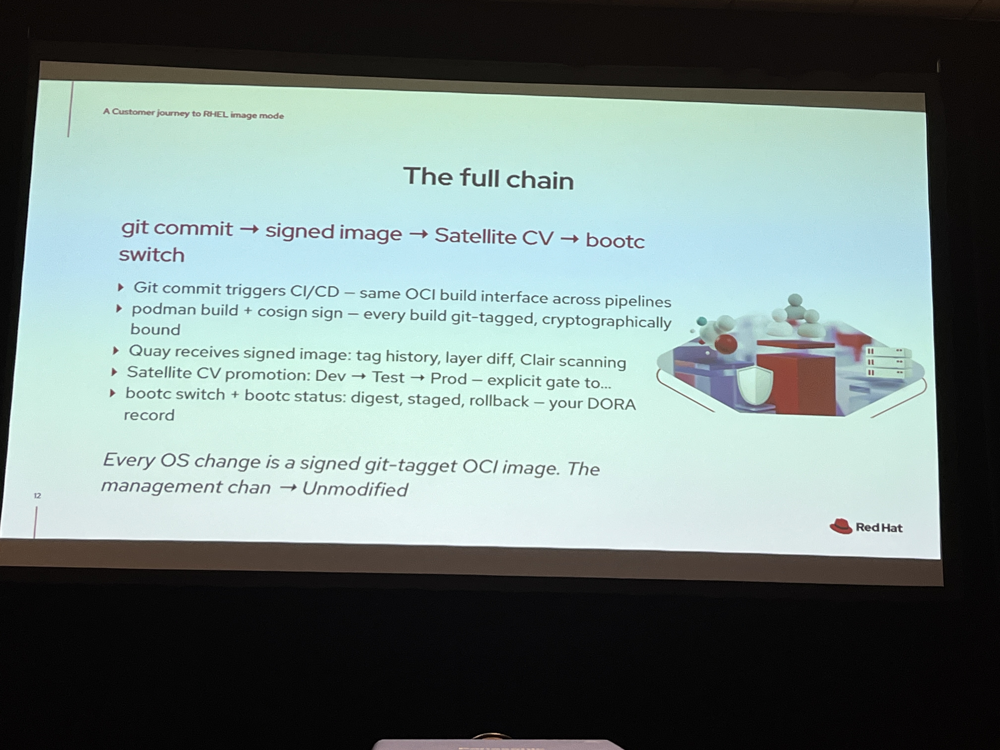
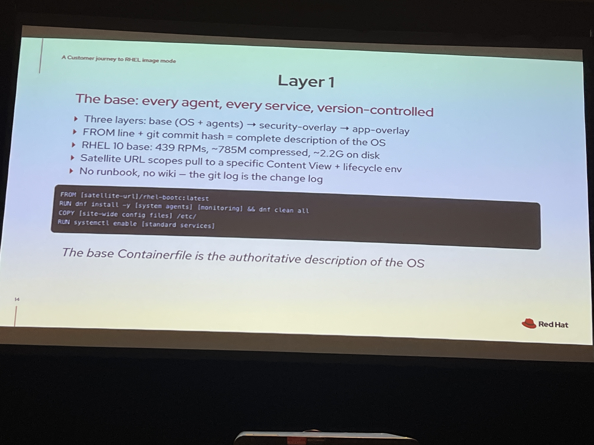
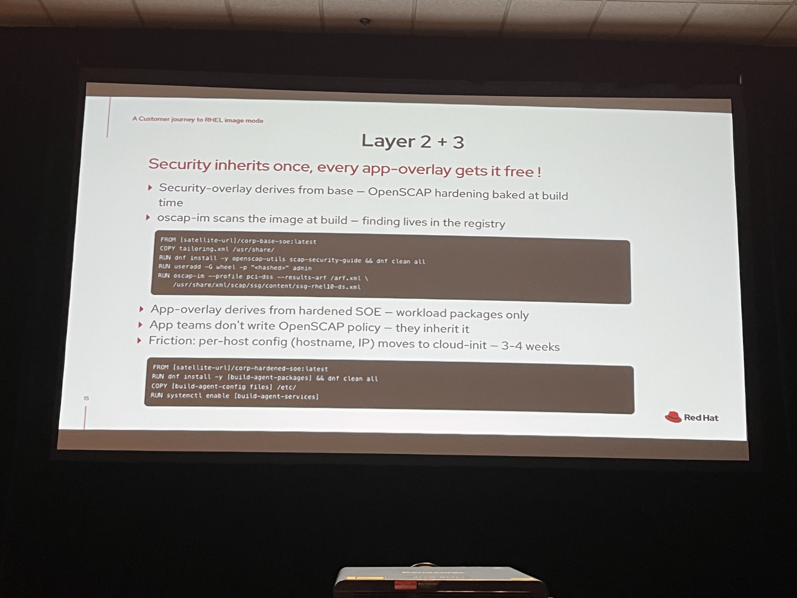
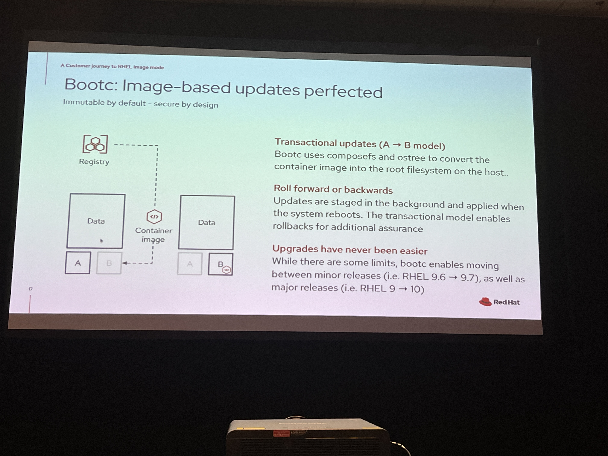
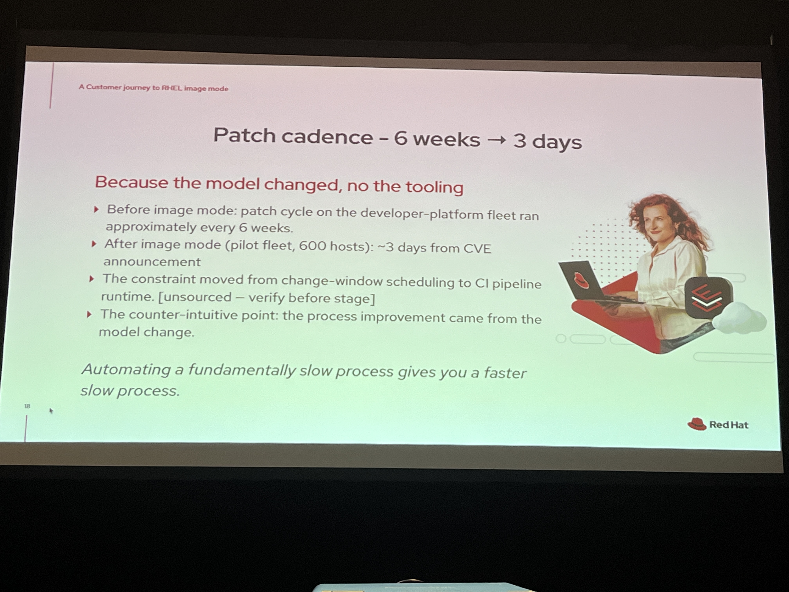

# A customer journey to image mode in RHEL: Hardening at scale without slowing delivery

This session shares how an a customer is using Red Hat Enterprise Linux (RHEL) image mode to raise their security baseline and simplify Day 2 operations across a large, regulated estate.

We will examine the bank’s approach to golden images, promotion and signing, controlled rollouts, and drift detection—as well as how Red Hat Satellite and Red Hat Lightspeed fit into the flow. Attendees will learn how this customer reduced change risk, accelerated patch cadence, and made audits more predictable. By the end of this session, you will know what pitfalls to avoid and have access to a starter playbook for your own image-based rollout.

Tihomir Hadzhiev, Senior Specialist Solution Architect, Red Hat

Session type: Breakout session
Tue, May 12th
11:45 AM - 12:25 PM EDT
B316 - Level 3

## Talk

Pain point isn't patch speed, it's ability to prove compliance - DORA, PDS2/PDS3, NIS2 (European versions of PCI, NIST, etc.)

Image mode artifacts:

- git comit + signed digest
- bootc rollback, recovery path takes minutes not hours
- cosign-signed OCI digests means tamper evidence
- auditable compliance reports

This talk is evidence I am on the right track with RHEL Image Mode for PCI compliant jump box

Leapp upgrades obsoleted if on RHEL Image Mode - upgrades much easier

## Customer Success Story

Financial sector (banking)

~ 600 CI/CD build hosts, not customer facing
single owner environment, so very flexible changes (no approvals needed, high change velocity allowed)
not core banking systems - able to experiment and learn Image Mode in a safe environment

Scope

- needed to be able to rollback on 10+ instances
- audit-pass DORA one quarter using image-digest providence
- zero incidents caused specifically from image mode delivery of OS

Red Hat Satellite is still the management plane

### Full Chain

## Links

<https://developers.redhat.com/articles/2025/08/25/what-image-mode-3-way-merge>

## Questions

Q: How are companies provisioning hosts with RHEL Image Mode? We currently use PXE boot for package mode installations

A: vmdk installations on VMware and using Ansible for host-specific provision parameters

Q: Can you have GRUB hold more than 2 bootc bootable digests? Maybe 1 active and 3-5 rollback images?

A: probably no reason to do this, old commits hold build history and the rollback digest is for if the new version breaks and we need an immediate rollback
    Q: driver breaks, system does not boot - any automatic rollbacks?
    A: no, would need external automation to monitor system health

Q: One of the slides showed Satellite with the current running images and what digest they were on. The images were `localhost/<image-name>:digest` - were those ISOs created and then the hosts were booted and registered to Satellite afterwards?
